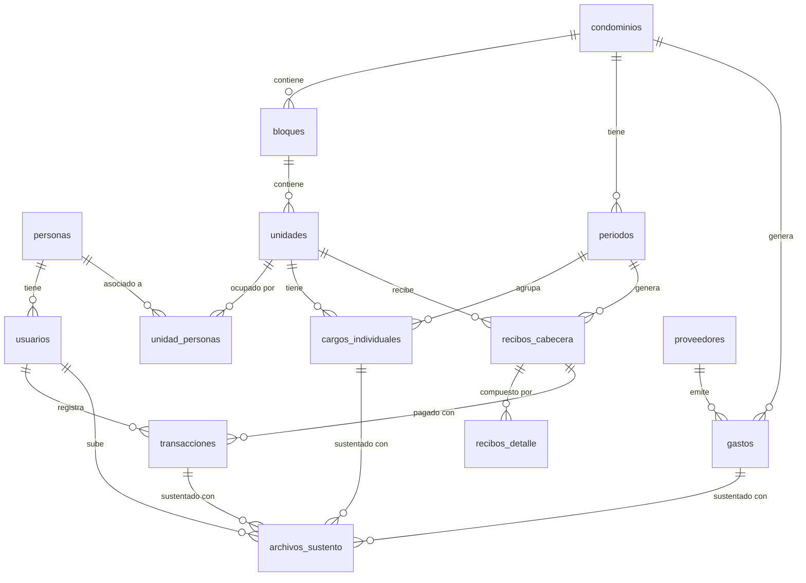

# Base de Datos - Altopia

Sistema de gestión para condominios con integración a Supabase Auth.

---

## 📋 Índice

1. [Módulo de Actores y Seguridad](#1-módulo-de-actores-y-seguridad)
2. [Módulo Inmobiliario](#2-módulo-inmobiliario)
3. [Módulo de Gastos y Proveedores](#3-módulo-de-gastos-y-proveedores)
4. [Módulo de Operaciones Individuales](#4-módulo-de-operaciones-individuales)
5. [Módulo de Pagos](#5-módulo-de-pagos)
6. [Módulo de Documentos](#6-módulo-de-documentos)
7. [Módulo de Facturación y Recibos](#7-módulo-de-facturación-y-recibos)
8. [Diagrama de Relaciones](#diagrama-de-relaciones)

---

## 1. Módulo de Actores y Seguridad

### `personas`
Representa a las personas físicas o jurídicas del sistema (propietarios, inquilinos, etc.).

| Campo | Tipo | Descripción |
|-------|------|-------------|
| `id` | `uuid` | Clave primaria |
| `nombre` | `varchar` | Nombre de la persona |
| `apellidos` | `varchar` | Apellidos |
| `dni_ruc` | `varchar` | Documento de identidad (único) |
| `telefono` | `varchar` | Número de contacto |
| `email_contacto` | `varchar` | Email de contacto |
| `created_at` | `timestamptz` | Fecha de creación |

### `usuarios`
Cuentas de acceso al sistema vinculadas a Supabase Auth.

| Campo | Tipo | Descripción |
|-------|------|-------------|
| `id` | `uuid` | Clave primaria |
| `persona_id` | `uuid` | FK a `personas` |
| `supabase_uuid` | `uuid` | Vinculación con `auth.users` de Supabase |
| `rol_sistema` | `text` | `ADMIN`, `PROPIETARIO`, `VIGILANTE` |
| `estado` | `bool` | Activo/Inactivo |
| `created_at` | `timestamptz` | Fecha de creación |

**Relaciones:**
- `persona_id` → `personas(id)` (CASCADE)

---

## 2. Módulo Inmobiliario

### `condominios`
Información de cada condominio administrado.

| Campo | Tipo | Descripción |
|-------|------|-------------|
| `id` | `uuid` | Clave primaria |
| `nombre` | `varchar` | Nombre del condominio |
| `direccion` | `text` | Dirección completa |
| `config_bancaria` | `jsonb` | Datos bancarios (banco, cuenta, CCI) |
| `config_interes` | `jsonb` | Configuración de interés de mora |
| `saldo_fondo_reserva` | `decimal` | Saldo del fondo de reserva |
| `created_at` | `timestamptz` | Fecha de creación |

**Ejemplo de JSONB:**
```json
{
  "config_bancaria": {"banco": "BCP", "cuenta": "191...", "cci": "..."},
  "config_interes": {"mora_activa": true, "porcentaje": 5.0}
}
```

### `bloques`
Torres, bloques o etapas dentro de un condominio.

| Campo | Tipo | Descripción |
|-------|------|-------------|
| `id` | `uuid` | Clave primaria |
| `condominio_id` | `uuid` | FK a `condominios` |
| `nombre` | `varchar` | Ej: "Torre A", "Bloque Norte" |
| `descripcion` | `text` | Descripción adicional |
| `created_at` | `timestamptz` | Fecha de creación |

**Relaciones:**
- `condominio_id` → `condominios(id)` (CASCADE)

### `unidades`
Departamentos, casas, locales comerciales.

| Campo | Tipo | Descripción |
|-------|------|-------------|
| `id` | `uuid` | Clave primaria |
| `bloque_id` | `uuid` | FK a `bloques` |
| `codigo` | `varchar` | Número de unidad (Ej: "101", "204") |
| `piso` | `int` | Número de piso |
| `coeficiente_area` | `decimal` | Coeficiente para prorrateo por m² |
| `tipo_uso` | `text` | `VIVIENDA`, `COMERCIAL` |
| `created_at` | `timestamptz` | Fecha de creación |

**Constraints:**
- `UNIQUE (bloque_id, codigo)` - No puede haber dos unidades con el mismo código en un bloque

**Relaciones:**
- `bloque_id` → `bloques(id)`

### `unidad_personas`
Relación muchos a muchos entre unidades y personas.

| Campo | Tipo | Descripción |
|-------|------|-------------|
| `id` | `bigint` | Clave primaria (identity) |
| `unidad_id` | `uuid` | FK a `unidades` |
| `persona_id` | `uuid` | FK a `personas` |
| `tipo_relacion` | `text` | `PROPIETARIO`, `INQUILINO`, `FAMILIAR` |
| `es_responsable_pago` | `bool` | Indica quién recibe el recibo |
| `created_at` | `timestamptz` | Fecha de creación |

**Relaciones:**
- `unidad_id` → `unidades(id)`
- `persona_id` → `personas(id)`

---

## 3. Módulo de Gastos y Proveedores

### `proveedores`
Empresas y personas que prestan servicios al condominio.

| Campo | Tipo | Descripción |
|-------|------|-------------|
| `id` | `bigint` | Clave primaria (identity) |
| `razon_social` | `varchar` | Nombre de la empresa |
| `ruc` | `varchar` | RUC del proveedor |
| `nombre_contacto` | `varchar` | Persona de contacto |
| `telefono_contacto` | `varchar` | Teléfono |
| `direccion` | `text` | Dirección |
| `created_at` | `timestamptz` | Fecha de creación |

### `gastos`
Facturas y gastos comunes del condominio.

| Campo | Tipo | Descripción |
|-------|------|-------------|
| `id` | `uuid` | Clave primaria |
| `condominio_id` | `uuid` | FK a `condominios` |
| `proveedor_id` | `bigint` | FK a `proveedores` |
| `descripcion` | `text` | Concepto del gasto |
| `monto` | `decimal` | Cantidad a pagar (≥ 0) |
| `fecha_gasto` | `date` | Fecha del gasto |
| `alcance` | `text` | `GLOBAL`, `BLOQUE` |
| `alcance_referencia_id` | `uuid` | ID del bloque (si aplica) |
| `estado_pago` | `text` | Estado del pago |
| `created_at` | `timestamptz` | Fecha de creación |

**Relaciones:**
- `condominio_id` → `condominios(id)`
- `proveedor_id` → `proveedores(id)`
- `alcance_referencia_id` → `bloques(id)` (si `alcance = 'BLOQUE'`)

---

## 4. Módulo de Operaciones Individuales

### `periodos`
Ciclos de facturación mensual.

| Campo | Tipo | Descripción |
|-------|------|-------------|
| `id` | `bigint` | Clave primaria (identity) |
| `condominio_id` | `uuid` | FK a `condominios` |
| `mes` | `int` | Mes (1-12) |
| `anio` | `int` | Año |
| `estado` | `text` | `ABIERTO`, `EN_PROCESO`, `CERRADO` |
| `fecha_cierre` | `timestamptz` | Fecha de cierre del periodo |
| `created_at` | `timestamptz` | Fecha de creación |

**Constraints:**
- `UNIQUE (condominio_id, mes, anio)` - Un periodo por mes/año

**Relaciones:**
- `condominio_id` → `condominios(id)`

### `cargos_individuales`
Cargos específicos de una unidad (agua, multas, etc.).

| Campo | Tipo | Descripción |
|-------|------|-------------|
| `id` | `bigint` | Clave primaria (identity) |
| `unidad_id` | `uuid` | FK a `unidades` |
| `periodo_id` | `bigint` | FK a `periodos` |
| `concepto` | `varchar` | Descripción del cargo |
| `monto` | `decimal` | Cantidad (≥ 0) |
| `es_lectura_medidor` | `bool` | Indica si es consumo de agua/luz |
| `created_at` | `timestamptz` | Fecha de creación |

**Relaciones:**
- `unidad_id` → `unidades(id)`
- `periodo_id` → `periodos(id)`

---

## 5. Módulo de Pagos

### `transacciones`
Registro de pagos realizados por usuarios (vouchers).

| Campo | Tipo | Descripción |
|-------|------|-------------|
| `id` | `uuid` | Clave primaria |
| `recibo_id` | `uuid` | FK a `recibos_cabecera` (nullable) |
| `usuario_registro_id` | `uuid` | FK a `usuarios` |
| `monto_reportado` | `decimal` | Monto declarado |
| `fecha_operacion` | `date` | Fecha del pago |
| `estado_validacion` | `text` | `PENDIENTE`, `APROBADO`, `RECHAZADO` |
| `comentario_admin` | `text` | Observaciones del administrador |
| `created_at` | `timestamptz` | Fecha de creación |

**Relaciones:**
- `recibo_id` → `recibos_cabecera(id)`
- `usuario_registro_id` → `usuarios(id)`

---

## 6. Módulo de Documentos

### `archivos_sustento`
Almacenamiento de documentos adjuntos (facturas, vouchers, etc.).

| Campo | Tipo | Descripción |
|-------|------|-------------|
| `id` | `uuid` | Clave primaria |
| `url_archivo` | `text` | URL del archivo en Supabase Storage |
| `nombre_original` | `varchar` | Nombre del archivo |
| `tipo_mime` | `varchar` | Tipo MIME (pdf, jpeg, etc.) |
| `gasto_id` | `uuid` | FK a `gastos` (polimórfico) |
| `cargo_individual_id` | `bigint` | FK a `cargos_individuales` (polimórfico) |
| `transaccion_id` | `uuid` | FK a `transacciones` (polimórfico) |
| `uploaded_by` | `uuid` | FK a `usuarios` |
| `created_at` | `timestamptz` | Fecha de creación |

**Constraint:**
- Solo **uno** de los tres campos (`gasto_id`, `cargo_individual_id`, `transaccion_id`) debe estar lleno.

**Relaciones:**
- `gasto_id` → `gastos(id)` (CASCADE)
- `cargo_individual_id` → `cargos_individuales(id)` (CASCADE)
- `transaccion_id` → `transacciones(id)` (CASCADE)
- `uploaded_by` → `usuarios(id)`

---

## 7. Módulo de Facturación y Recibos

### `recibos_cabecera`
Recibo mensual consolidado por unidad.

| Campo | Tipo | Descripción |
|-------|------|-------------|
| `id` | `uuid` | Clave primaria |
| `periodo_id` | `bigint` | FK a `periodos` |
| `unidad_id` | `uuid` | FK a `unidades` |
| `subtotal_gastos_comunes` | `decimal` | Suma de gastos comunes |
| `subtotal_cargos_individuales` | `decimal` | Suma de cargos propios |
| `deuda_anterior` | `decimal` | Deuda arrastrada |
| `interes_mora` | `decimal` | Interés por mora |
| `total_pagar` | `decimal` | Total del recibo |
| `estado_pago` | `text` | `PENDIENTE`, `PAGADO`, `PARCIAL`, `ANULADO` |
| `fecha_vencimiento` | `date` | Fecha límite de pago |
| `deleted_at` | `timestamptz` | Soft delete |
| `created_at` | `timestamptz` | Fecha de creación |

**Relaciones:**
- `periodo_id` → `periodos(id)`
- `unidad_id` → `unidades(id)`

### `recibos_detalle`
Líneas individuales del recibo (desglose).

| Campo | Tipo | Descripción |
|-------|------|-------------|
| `id` | `bigint` | Clave primaria (identity) |
| `recibo_id` | `uuid` | FK a `recibos_cabecera` |
| `tipo_item` | `text` | Tipo de línea (ver tabla) |
| `concepto` | `varchar` | Descripción del ítem |
| `monto` | `decimal` | Monto de la línea |
| `gasto_origen_id` | `uuid` | FK a `gastos` (trazabilidad) |
| `cargo_individual_origen_id` | `bigint` | FK a `cargos_individuales` (trazabilidad) |

**Tipos de Item:**
| Tipo | Descripción |
|------|-------------|
| `GASTO_COMUN` | Gastos prorrateados del condominio |
| `CARGO_INDIVIDUAL` | Cargos específicos de la unidad |
| `MORA` | Interés por pago tardío |
| `DEUDA_ANTERIOR` | Saldo pendiente de meses anteriores |
| `FONDO_RESERVA` | Aporte al fondo de reserva |

**Relaciones:**
- `recibo_id` → `recibos_cabecera(id)` (CASCADE)
- `gasto_origen_id` → `gastos(id)`
- `cargo_individual_origen_id` → `cargos_individuales(id)`

---

## Diagrama de Relaciones



---

## SQL Completo

```sql
-- =============================================================================
-- 1. MÓDULO DE ACTORES Y SEGURIDAD (Integración Supabase Auth)
-- =============================================================================

create table personas (
    id uuid primary key default gen_random_uuid(),
    nombre varchar not null,
    apellidos varchar not null,
    dni_ruc varchar unique not null,
    telefono varchar,
    email_contacto varchar,
    created_at timestamptz default now()
);

create table usuarios (
    id uuid primary key default gen_random_uuid(),
    persona_id uuid references personas (id) on delete cascade,
    supabase_uuid uuid unique,
    rol_sistema text check (rol_sistema in ('ADMIN', 'PROPIETARIO', 'VIGILANTE')),
    estado bool not null default true,
    created_at timestamptz default now()
);

-- =============================================================================
-- 2. MÓDULO INMOBILIARIO (Estructura Física)
-- =============================================================================

create table condominios (
    id uuid primary key default gen_random_uuid(),
    nombre varchar not null,
    direccion text not null,
    config_bancaria jsonb,
    config_interes jsonb,
    saldo_fondo_reserva decimal default 0,
    created_at timestamptz default now()
);

create table bloques (
    id uuid primary key default gen_random_uuid(),
    condominio_id uuid references condominios (id) on delete cascade,
    nombre varchar not null,
    descripcion text,
    created_at timestamptz default now()
);

create table unidades (
    id uuid primary key default gen_random_uuid(),
    bloque_id uuid references bloques (id),
    codigo varchar not null,
    piso int not null,
    coeficiente_area decimal not null default 0,
    tipo_uso text check (tipo_uso in ('VIVIENDA', 'COMERCIAL')) default 'VIVIENDA',
    created_at timestamptz default now(),
    unique (bloque_id, codigo)
);

create table unidad_personas (
    id bigint primary key generated always as identity,
    unidad_id uuid references unidades (id),
    persona_id uuid references personas (id),
    tipo_relacion text check (tipo_relacion in ('PROPIETARIO', 'INQUILINO', 'FAMILIAR')),
    es_responsable_pago bool not null default false,
    created_at timestamptz default now()
);

-- =============================================================================
-- 3. MÓDULO DE GASTOS Y PROVEEDORES
-- =============================================================================

create table proveedores (
    id bigint primary key generated always as identity,
    razon_social varchar not null,
    ruc varchar not null,
    nombre_contacto varchar,
    telefono_contacto varchar,
    direccion text,
    created_at timestamptz default now()
);

create table gastos (
    id uuid primary key default gen_random_uuid(),
    condominio_id uuid references condominios (id),
    proveedor_id bigint references proveedores (id),
    descripcion text not null,
    monto decimal not null check (monto >= 0),
    fecha_gasto date not null,
    alcance text check (alcance in ('GLOBAL', 'BLOQUE')),
    alcance_referencia_id uuid,
    estado_pago text default 'PAGADO',
    created_at timestamptz default now()
);

-- =============================================================================
-- 4. MÓDULO DE OPERACIONES INDIVIDUALES (Cargos directos)
-- =============================================================================

create table periodos (
    id bigint primary key generated always as identity,
    condominio_id uuid references condominios (id),
    mes int not null check (mes between 1 and 12),
    anio int not null,
    estado text check (estado in ('ABIERTO', 'EN_PROCESO', 'CERRADO')) default 'ABIERTO',
    fecha_cierre timestamptz,
    created_at timestamptz default now(),
    unique(condominio_id, mes, anio)
);

create table cargos_individuales (
    id bigint primary key generated always as identity,
    unidad_id uuid references unidades (id),
    periodo_id bigint references periodos (id),
    concepto varchar not null,
    monto decimal not null check (monto >= 0),
    es_lectura_medidor bool not null default false,
    created_at timestamptz default now()
);

-- =============================================================================
-- 5. MÓDULO DE PAGOS (Transacciones)
-- =============================================================================

create table transacciones (
    id uuid primary key default gen_random_uuid(),
    recibo_id uuid,
    usuario_registro_id uuid references usuarios (id),
    monto_reportado decimal not null,
    fecha_operacion date not null,
    estado_validacion text check (estado_validacion in ('PENDIENTE', 'APROBADO', 'RECHAZADO')) default 'PENDIENTE',
    comentario_admin text,
    created_at timestamptz default now()
);

-- =============================================================================
-- 6. TABLA CENTRAL DE DOCUMENTOS (Sustentos Múltiples)
-- =============================================================================

create table archivos_sustento (
    id uuid primary key default gen_random_uuid(),
    url_archivo text not null,
    nombre_original varchar,
    tipo_mime varchar,
    gasto_id uuid references gastos (id) on delete cascade,
    cargo_individual_id bigint references cargos_individuales (id) on delete cascade,
    transaccion_id uuid references transacciones (id) on delete cascade,
    uploaded_by uuid references usuarios (id),
    created_at timestamptz default now(),
    check (
        (case when gasto_id is not null then 1 else 0 end +
         case when cargo_individual_id is not null then 1 else 0 end +
         case when transaccion_id is not null then 1 else 0 end) = 1
    )
);

-- =============================================================================
-- 7. MÓDULO CORE: FACTURACIÓN Y RECIBOS (El Recibo Final)
-- =============================================================================

create table recibos_cabecera (
    id uuid primary key default gen_random_uuid(),
    periodo_id bigint references periodos (id),
    unidad_id uuid references unidades (id),
    subtotal_gastos_comunes decimal not null default 0,
    subtotal_cargos_individuales decimal not null default 0,
    deuda_anterior decimal not null default 0,
    interes_mora decimal not null default 0,
    total_pagar decimal not null,
    estado_pago text check (estado_pago in ('PENDIENTE', 'PAGADO', 'PARCIAL', 'ANULADO')) default 'PENDIENTE',
    fecha_vencimiento date not null,
    deleted_at timestamptz,
    created_at timestamptz default now()
);

create table recibos_detalle (
    id bigint primary key generated always as identity,
    recibo_id uuid references recibos_cabecera (id) on delete cascade,
    tipo_item text check (tipo_item in ('GASTO_COMUN', 'CARGO_INDIVIDUAL', 'MORA', 'DEUDA_ANTERIOR', 'FONDO_RESERVA')) not null,
    concepto varchar not null,
    monto decimal not null,
    gasto_origen_id uuid references gastos (id),
    cargo_individual_origen_id bigint references cargos_individuales (id)
);

-- Agregar la FK de recibo en transacciones
alter table transacciones
    add constraint fk_transaccion_recibo
    foreign key (recibo_id) references recibos_cabecera (id);
```