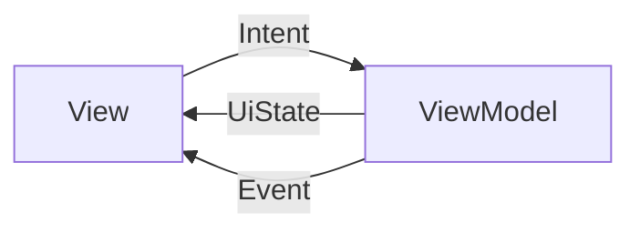
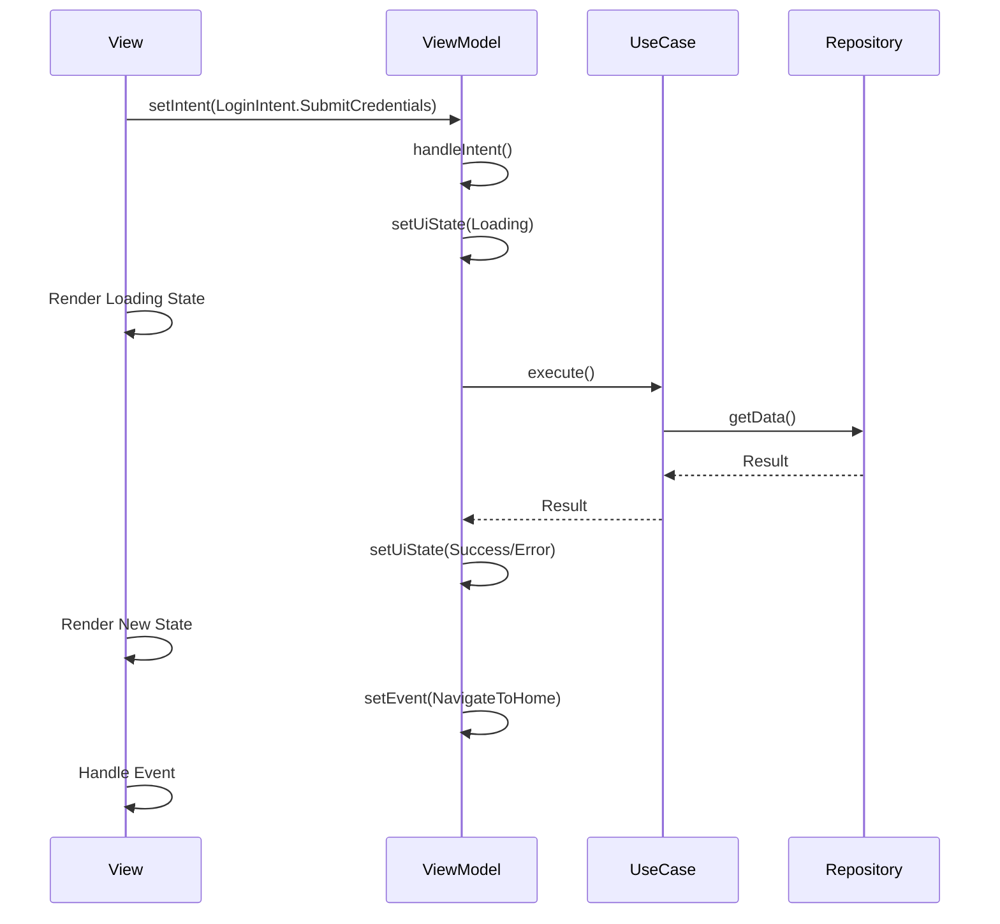

# Guía de Implementación MVI con BaseViewModel

## Índice
- [1. Introducción](#1-introducción)
- [2. Arquitectura MVI](#2-arquitectura-mvi)
- [3. BaseViewModel](#3-baseviewmodel)
- [4. Estructura de Features](#4-estructura-de-features)
- [5. Componentes del MVI](#5-componentes-del-mvi)
- [6. Gestión de Diálogos](#6-gestión-de-diálogos)
- [7. Ejemplo Práctico: Login Feature](#7-ejemplo-práctico-login-feature)
- [8. Mejores Prácticas](#8-mejores-prácticas)

---

## 1. Introducción

Esta guía describe cómo implementar el patrón **MVI (Model-View-Intent)** en el proyecto Altopia utilizando el `BaseViewModel` como clase base para todos los ViewModels.

### ¿Qué es MVI?

MVI es un patrón arquitectónico que proporciona un flujo de datos unidireccional:



- **View**: Renderiza el estado y envía intenciones del usuario
- **Intent**: Acciones del usuario que modifican el estado
- **UiState**: Estado inmutable de la UI
- **Event**: Eventos únicos (navegación, toasts, etc.)

---

## 2. Arquitectura MVI

### Flujo de Datos



### Principios Clave

1. **Estado Inmutable**: El `UiState` nunca se muta directamente
2. **Flujo Unidireccional**: Los datos fluyen en una sola dirección
3. **Separación de Responsabilidades**: Cada componente tiene un propósito claro
4. **Single Source of Truth**: El ViewModel es la única fuente de verdad

---

## 3. BaseViewModel

### Descripción General

`BaseViewModel` es una clase abstracta genérica que encapsula la lógica común de MVI:

```kotlin
abstract class BaseViewModel<UI_STATE, INTENT, EVENT> : ViewModel()
```

### Componentes Principales

#### 3.1 UI State

```kotlin
private val _uiState: MutableStateFlow<UI_STATE> = MutableStateFlow(initialState)
val uiState = _uiState.asStateFlow()
```

- **Propósito**: Representa el estado actual de la UI
- **Tipo**: `StateFlow` (observable)
- **Acceso**: Solo lectura desde la View
- **Actualización**: Mediante `setUiState { ... }`

#### 3.2 Intent

```kotlin
private val intents: MutableSharedFlow<INTENT> = MutableSharedFlow()
```

- **Propósito**: Canal para recibir intenciones del usuario
- **Tipo**: `SharedFlow`
- **Envío**: Mediante `setIntent(intent)`
- **Procesamiento**: En `handleIntent(intent)`

#### 3.3 Event

```kotlin
private val _event: MutableSharedFlow<EVENT> = MutableSharedFlow()
val event = _event.asSharedFlow()
```

- **Propósito**: Eventos únicos (navegación, toasts, etc.)
- **Tipo**: `SharedFlow`
- **Emisión**: Mediante `setEvent(event)`
- **Consumo**: Una sola vez en la View

### Métodos Protegidos

#### setUiState
```kotlin
protected fun setUiState(reducer: UI_STATE.() -> UI_STATE)
```
Actualiza el estado de forma inmutable usando una función lambda.

**Ejemplo:**
```kotlin
setUiState { copy(isLoading = true) }
```

#### setEvent
```kotlin
protected fun setEvent(event: EVENT)
```
Emite un evento único.

**Ejemplo:**
```kotlin
setEvent(LoginEvent.NavigateToHome)
```

### Métodos Abstractos

#### createInitialState
```kotlin
protected abstract fun createInitialState(): UI_STATE
```
Define el estado inicial del ViewModel.

#### handleIntent
```kotlin
protected abstract suspend fun handleIntent(intent: INTENT)
```
Procesa las intenciones del usuario.

---

## 4. Estructura de Features

### Organización de Directorios

La capa de presentación se organiza en **features**, donde cada feature agrupa pantallas relacionadas:

```
presentation/
├── features/
│   ├── login/
│   │   ├── LoginScreen.kt
│   │   ├── LoginViewModel.kt
│   │   ├── LoginUiState.kt
│   │   ├── LoginIntent.kt
│   │   └── LoginEvent.kt
│   ├── profile/
│   │   ├── ProfileScreen.kt
│   │   ├── ProfileViewModel.kt
│   │   ├── ProfileUiState.kt
│   │   ├── ProfileIntent.kt
│   │   └── ProfileEvent.kt
│   └── settings/
│       ├── SettingsScreen.kt
│       ├── SettingsViewModel.kt
│       ├── SettingsUiState.kt
│       ├── SettingsIntent.kt
│       └── SettingsEvent.kt
├── model/
│   └── ManagedDialogConfig.kt
├── navigation/
│   └── AppNavigation.kt
└── viewmodel/
    └── BaseViewModel.kt
```

### Nomenclatura

Cada componente sigue una convención de nombres clara:

| Componente | Nombre | Ejemplo |
|------------|--------|---------|
| Screen | `{Feature}Screen.kt` | `LoginScreen.kt` |
| ViewModel | `{Feature}ViewModel.kt` | `LoginViewModel.kt` |
| UiState | `{Feature}UiState.kt` | `LoginUiState.kt` |
| Intent | `{Feature}Intent.kt` | `LoginIntent.kt` |
| Event | `{Feature}Event.kt` | `LoginEvent.kt` |

---

## 5. Componentes del MVI

### 5.1 UI State

El **UiState** representa el estado completo de la pantalla.

#### Estructura

```kotlin
data class LoginUiState(
    val email: String = "",
    val password: String = "",
    val isLoading: Boolean = false,
    val errorMessage: String? = null,
    val isEmailValid: Boolean = true,
    val isPasswordValid: Boolean = true
)
```

#### Características

- **Data Class**: Siempre usar `data class` para inmutabilidad
- **Valores Predeterminados**: Proporcionar defaults para todos los campos
- **Estado Completo**: Incluir todo lo necesario para renderizar la UI
- **Nullable**: Usar nullable para estados opcionales (ej: `errorMessage`)

#### Anti-Patrones ❌

```kotlin
// ❌ NO usar sealed class para estados simples
sealed class LoginUiState {
    object Idle : LoginUiState()
    object Loading : LoginUiState()
    data class Success(val user: User) : LoginUiState()
    data class Error(val message: String) : LoginUiState()
}
```

**Problema**: Pierdes el estado de los campos cuando cambias entre estados.

#### Patrón Recomendado ✅

```kotlin
// ✅ Usar data class con flags
data class LoginUiState(
    val email: String = "",
    val password: String = "",
    val isLoading: Boolean = false,
    val errorMessage: String? = null,
    val user: User? = null
)
```

### 5.2 Intent

Los **Intents** representan las acciones del usuario.

#### Estructura

```kotlin
sealed interface LoginIntent {
    data class EmailChanged(val email: String) : LoginIntent
    data class PasswordChanged(val password: String) : LoginIntent
    data object SubmitCredentials : LoginIntent
    data object ClearError : LoginIntent
    data object ForgotPasswordClicked : LoginIntent
}
```

#### Características

- **Sealed Interface**: Conjunto cerrado de intenciones
- **Descriptivos**: Nombres claros que describen la acción
- **Data Object/Class**: `data object` para intents sin datos, `data class` con datos
- **Granulares**: Un intent por acción específica

#### Ejemplo de Envío

```kotlin
// Desde la View
viewModel.setIntent(LoginIntent.EmailChanged("user@example.com"))
viewModel.setIntent(LoginIntent.SubmitCredentials)
```

### 5.3 Event

Los **Events** son eventos únicos consumidos una sola vez.

#### Estructura

```kotlin
sealed interface LoginEvent {
    data object NavigateToHome : LoginEvent
    data object NavigateToForgotPassword : LoginEvent
    data class ShowToast(val message: String) : LoginEvent
    data class ShowError(val error: String) : LoginEvent
}
```

#### Características

- **Sealed Interface**: Conjunto cerrado de eventos
- **Single-Shot**: Se consumen una sola vez
- **Side Effects**: Navegación, toasts, diálogos, etc.
- **No Estado**: No representan estado de la UI

#### Ejemplo de Consumo

```kotlin
// En la View
LaunchedEffect(Unit) {
    viewModel.event.collect { event ->
        when (event) {
            LoginEvent.NavigateToHome -> onNavigateToHome()
            is LoginEvent.ShowToast -> showToast(event.message)
            is LoginEvent.ShowError -> showErrorDialog(event.error)
        }
    }
}
```

---

## 6. Gestión de Diálogos

El `BaseViewModel` incluye un sistema de gestión de diálogos que abstrae la lógica de mostrar/ocultar diálogos.

### DialogInfo

```kotlin
data class DialogInfo(
    val title: String,
    val description: String,
    val primaryButtonText: String,
    val secondaryButtonText: String? = null,
    val showCloseButton: Boolean = false,
    val dismissOnBackClick: Boolean = true,
    val dismissOnClickOutside: Boolean = true,
    val onDismiss: (() -> Unit)? = null,
    val onPrimaryButtonClick: (() -> Unit)? = null,
    val onSecondaryButtonClick: (() -> Unit)? = null
)
```

### Mostrar un Diálogo

```kotlin
// En el ViewModel
protected fun showLoginErrorDialog(message: String) {
    showDialog(
        DialogInfo(
            title = "Error de Inicio de Sesión",
            description = message,
            primaryButtonText = "Reintentar",
            secondaryButtonText = "Cancelar",
            onPrimaryButtonClick = {
                // Lógica de reintento
                setIntent(LoginIntent.SubmitCredentials)
            },
            onSecondaryButtonClick = {
                // Lógica de cancelación
                setUiState { copy(errorMessage = null) }
            }
        )
    )
}
```

### Observar el Diálogo en la View

```kotlin
val dialogState by viewModel.managedDialogState.collectAsState()

// Renderizar diálogo si existe
dialogState?.let { config ->
    AlertDialog(
        onDismissRequest = config.finalOnDismissRequest,
        title = { Text(config.userConfig.title) },
        text = { Text(config.userConfig.description) },
        confirmButton = {
            Button(onClick = config.finalOnPrimaryButtonClick) {
                Text(config.userConfig.primaryButtonText)
            }
        },
        dismissButton = config.finalOnSecondaryButtonClick?.let { callback ->
            {
                Button(onClick = callback) {
                    Text(config.userConfig.secondaryButtonText ?: "")
                }
            }
        }
    )
}
```

### Cerrar el Diálogo

```kotlin
// Desde el ViewModel
dismissDialog()

// O automáticamente al hacer clic en los botones (manejado internamente)
```

---

## 7. Ejemplo Práctico: Login Feature

### 7.1 LoginUiState.kt

```kotlin
package org.terratec.altopia.presentation.features.login

data class LoginUiState(
    val email: String = "",
    val password: String = "",
    val isLoading: Boolean = false,
    val errorMessage: String? = null,
    val isEmailValid: Boolean = true,
    val isPasswordValid: Boolean = true
)
```

### 7.2 LoginIntent.kt

```kotlin
package org.terratec.altopia.presentation.features.login

sealed interface LoginIntent {
    data class EmailChanged(val email: String) : LoginIntent
    data class PasswordChanged(val password: String) : LoginIntent
    data object SubmitCredentials : LoginIntent
    data object ClearError : LoginIntent
    data object ForgotPasswordClicked : LoginIntent
}
```

### 7.3 LoginEvent.kt

```kotlin
package org.terratec.altopia.presentation.features.login

import org.terratec.altopia.domain.model.User

sealed interface LoginEvent {
    data class NavigateToHome(val user: User) : LoginEvent
    data object NavigateToForgotPassword : LoginEvent
    data class ShowToast(val message: String) : LoginEvent
}
```

### 7.4 LoginViewModel.kt

```kotlin
package org.terratec.altopia.presentation.features.login

import org.terratec.altopia.domain.usecase.auth.LoginUseCase
import org.terratec.altopia.presentation.model.DialogInfo
import org.terratec.altopia.presentation.viewmodel.BaseViewModel

class LoginViewModel(
    private val loginUseCase: LoginUseCase
) : BaseViewModel<LoginUiState, LoginIntent, LoginEvent>() {

    override fun createInitialState(): LoginUiState = LoginUiState()

    override suspend fun handleIntent(intent: LoginIntent) {
        when (intent) {
            is LoginIntent.EmailChanged -> handleEmailChanged(intent.email)
            is LoginIntent.PasswordChanged -> handlePasswordChanged(intent.password)
            LoginIntent.SubmitCredentials -> handleSubmitCredentials()
            LoginIntent.ClearError -> handleClearError()
            LoginIntent.ForgotPasswordClicked -> handleForgotPassword()
        }
    }

    private fun handleEmailChanged(email: String) {
        setUiState {
            copy(
                email = email,
                isEmailValid = email.isBlank() || isValidEmail(email),
                errorMessage = null
            )
        }
    }

    private fun handlePasswordChanged(password: String) {
        setUiState {
            copy(
                password = password,
                isPasswordValid = password.isBlank() || password.length >= 6,
                errorMessage = null
            )
        }
    }

    private suspend fun handleSubmitCredentials() {
        val currentState = uiState.value
        
        // Validación
        if (!validateCredentials(currentState)) {
            return
        }

        // Loading state
        setUiState { copy(isLoading = true, errorMessage = null) }

        // Ejecutar use case
        loginUseCase(currentState.email, currentState.password)
            .onSuccess { user ->
                setUiState { copy(isLoading = false) }
                setEvent(LoginEvent.NavigateToHome(user))
            }
            .onFailure { error ->
                setUiState {
                    copy(
                        isLoading = false,
                        errorMessage = error.message ?: "Error desconocido"
                    )
                }
                showLoginErrorDialog(error.message ?: "Error desconocido")
            }
    }

    private fun validateCredentials(state: LoginUiState): Boolean {
        val emailValid = isValidEmail(state.email)
        val passwordValid = state.password.length >= 6

        if (!emailValid || !passwordValid) {
            setUiState {
                copy(
                    isEmailValid = emailValid,
                    isPasswordValid = passwordValid,
                    errorMessage = "Por favor, verifica tus credenciales"
                )
            }
            return false
        }

        return true
    }

    private fun handleClearError() {
        setUiState { copy(errorMessage = null) }
    }

    private fun handleForgotPassword() {
        setEvent(LoginEvent.NavigateToForgotPassword)
    }

    private fun isValidEmail(email: String): Boolean {
        return android.util.Patterns.EMAIL_ADDRESS.matcher(email).matches()
    }

    private fun showLoginErrorDialog(message: String) {
        showDialog(
            DialogInfo(
                title = "Error de Inicio de Sesión",
                description = message,
                primaryButtonText = "Entendido",
                onPrimaryButtonClick = {
                    // El diálogo se cierra automáticamente
                }
            )
        )
    }
}
```

### 7.5 LoginScreen.kt

```kotlin
package org.terratec.altopia.presentation.features.login

import androidx.compose.foundation.layout.*
import androidx.compose.foundation.text.KeyboardOptions
import androidx.compose.material3.*
import androidx.compose.runtime.*
import androidx.compose.ui.Alignment
import androidx.compose.ui.Modifier
import androidx.compose.ui.text.input.KeyboardType
import androidx.compose.ui.text.input.PasswordVisualTransformation
import androidx.compose.ui.unit.dp
import org.koin.compose.viewmodel.koinViewModel
import org.terratec.altopia.domain.model.User
import org.terratec.altopia.presentation.ui.components.BaseScreen

@Composable
fun LoginScreen(
    onNavigateToHome: (User) -> Unit,
    onNavigateToForgotPassword: () -> Unit,
    viewModel: LoginViewModel = koinViewModel()
) {
    val uiState by viewModel.uiState.collectAsState()
    val dialogState by viewModel.managedDialogState.collectAsState()

    // Colectar eventos
    LaunchedEffect(Unit) {
        viewModel.event.collect { event ->
            when (event) {
                is LoginEvent.NavigateToHome -> onNavigateToHome(event.user)
                LoginEvent.NavigateToForgotPassword -> onNavigateToForgotPassword()
                is LoginEvent.ShowToast -> {
                    // Mostrar toast (implementación depende del sistema)
                }
            }
        }
    }

    BaseScreen {
        LoginContent(
            uiState = uiState,
            onIntent = viewModel::setIntent
        )

        // Renderizar diálogo si existe
        dialogState?.let { config ->
            AlertDialog(
                onDismissRequest = config.finalOnDismissRequest,
                title = { Text(config.userConfig.title) },
                text = { Text(config.userConfig.description) },
                confirmButton = {
                    Button(onClick = config.finalOnPrimaryButtonClick) {
                        Text(config.userConfig.primaryButtonText)
                    }
                },
                dismissButton = config.finalOnSecondaryButtonClick?.let { callback ->
                    {
                        TextButton(onClick = callback) {
                            Text(config.userConfig.secondaryButtonText ?: "")
                        }
                    }
                }
            )
        }
    }
}

@Composable
private fun LoginContent(
    uiState: LoginUiState,
    onIntent: (LoginIntent) -> Unit
) {
    Column(
        modifier = Modifier
            .fillMaxSize()
            .padding(16.dp),
        verticalArrangement = Arrangement.Center,
        horizontalAlignment = Alignment.CenterHorizontally
    ) {
        Text(
            text = "Iniciar Sesión",
            style = MaterialTheme.typography.headlineMedium
        )

        Spacer(modifier = Modifier.height(32.dp))

        // Email Field
        OutlinedTextField(
            value = uiState.email,
            onValueChange = { onIntent(LoginIntent.EmailChanged(it)) },
            label = { Text("Email") },
            keyboardOptions = KeyboardOptions(keyboardType = KeyboardType.Email),
            modifier = Modifier.fillMaxWidth(),
            singleLine = true,
            enabled = !uiState.isLoading,
            isError = !uiState.isEmailValid,
            supportingText = if (!uiState.isEmailValid) {
                { Text("Email inválido") }
            } else null
        )

        Spacer(modifier = Modifier.height(16.dp))

        // Password Field
        OutlinedTextField(
            value = uiState.password,
            onValueChange = { onIntent(LoginIntent.PasswordChanged(it)) },
            label = { Text("Contraseña") },
            visualTransformation = PasswordVisualTransformation(),
            keyboardOptions = KeyboardOptions(keyboardType = KeyboardType.Password),
            modifier = Modifier.fillMaxWidth(),
            singleLine = true,
            enabled = !uiState.isLoading,
            isError = !uiState.isPasswordValid,
            supportingText = if (!uiState.isPasswordValid) {
                { Text("La contraseña debe tener al menos 6 caracteres") }
            } else null
        )

        // Error Message
        if (uiState.errorMessage != null) {
            Spacer(modifier = Modifier.height(8.dp))
            Text(
                text = uiState.errorMessage,
                color = MaterialTheme.colorScheme.error,
                style = MaterialTheme.typography.bodySmall
            )
        }

        Spacer(modifier = Modifier.height(24.dp))

        // Login Button
        Button(
            onClick = { onIntent(LoginIntent.SubmitCredentials) },
            enabled = !uiState.isLoading && 
                     uiState.email.isNotBlank() && 
                     uiState.password.isNotBlank(),
            modifier = Modifier.fillMaxWidth()
        ) {
            if (uiState.isLoading) {
                CircularProgressIndicator(
                    modifier = Modifier.size(24.dp),
                    color = MaterialTheme.colorScheme.onPrimary
                )
            } else {
                Text("Iniciar Sesión")
            }
        }

        Spacer(modifier = Modifier.height(16.dp))

        // Forgot Password
        TextButton(
            onClick = { onIntent(LoginIntent.ForgotPasswordClicked) },
            enabled = !uiState.isLoading
        ) {
            Text("¿Olvidaste tu contraseña?")
        }
    }
}
```

---

## 8. Mejores Prácticas

### 8.1 UiState

✅ **DO:**
- Usar `data class` para estados simples
- Proporcionar valores predeterminados
- Mantener inmutabilidad
- Incluir todo el estado necesario

❌ **DON'T:**
- Usar `sealed class` para estados simples
- Mutar el estado directamente
- Dividir el estado en múltiples `StateFlow`

### 8.2 Intent

✅ **DO:**
- Usar `sealed interface` para type-safety
- Nombres descriptivos y específicos
- Un intent por acción del usuario
- Agrupar intents relacionados

❌ **DON'T:**
- Intents genéricos como `UpdateState`
- Lógica de negocio en los intents
- Mezclar intents de diferentes features

### 8.3 Event

✅ **DO:**
- Usar para side effects (navegación, toasts)
- Consumir una sola vez
- Nombres descriptivos
- Mantener events simples

❌ **DON'T:**
- Usar para estado de UI
- Ignorar events sin procesar
- Events complejos con lógica

### 8.4 ViewModel

✅ **DO:**
- Toda la lógica en `handleIntent`
- Usar `setUiState { copy(...) }`
- Llamar use cases para lógica de negocio
- Manejo de errores consistente

❌ **DON'T:**
- Lógica de negocio en el ViewModel
- Acceso directo a la View
- Mutar estado fuera de `setUiState`

### 8.5 Screen

✅ **DO:**
- Observar `uiState` con `collectAsState`
- Colectar `event` con `LaunchedEffect`
- Enviar intents para acciones del usuario
- Composables sin estado (stateless)

❌ **DON'T:**
- Lógica de negocio en la View
- Múltiples observaciones del mismo estado
- Estado local innecesario

### 8.6 Gestión de Diálogos

✅ **DO:**
- Usar `showDialog()` para diálogos manejados
- Configurar callbacks en `DialogInfo`
- Observar `managedDialogState` en la View
- Cerrar automáticamente con botones

❌ **DON'T:**
- Manejar estado del diálogo manualmente
- Olvidar cerrar el diálogo
- Lógica compleja en callbacks

---

## Conclusión

El patrón MVI con `BaseViewModel` proporciona una arquitectura robusta, predecible y fácil de testear. Siguiendo esta guía, podrás implementar features de manera consistente y mantener un código limpio y organizado.

### Checklist de Implementación

Al crear una nueva feature, asegúrate de:

- [ ] Crear directorio en `presentation/features/{feature}/`
- [ ] Definir `{Feature}UiState.kt` (data class)
- [ ] Definir `{Feature}Intent.kt` (sealed interface)
- [ ] Definir `{Feature}Event.kt` (sealed interface)
- [ ] Implementar `{Feature}ViewModel.kt` extendiendo `BaseViewModel`
- [ ] Implementar `{Feature}Screen.kt` con composables
- [ ] Registrar ViewModel en Koin
- [ ] Probar la feature completa

---

**Fecha de última actualización**: 2025-11-23  
**Versión**: 1.0
