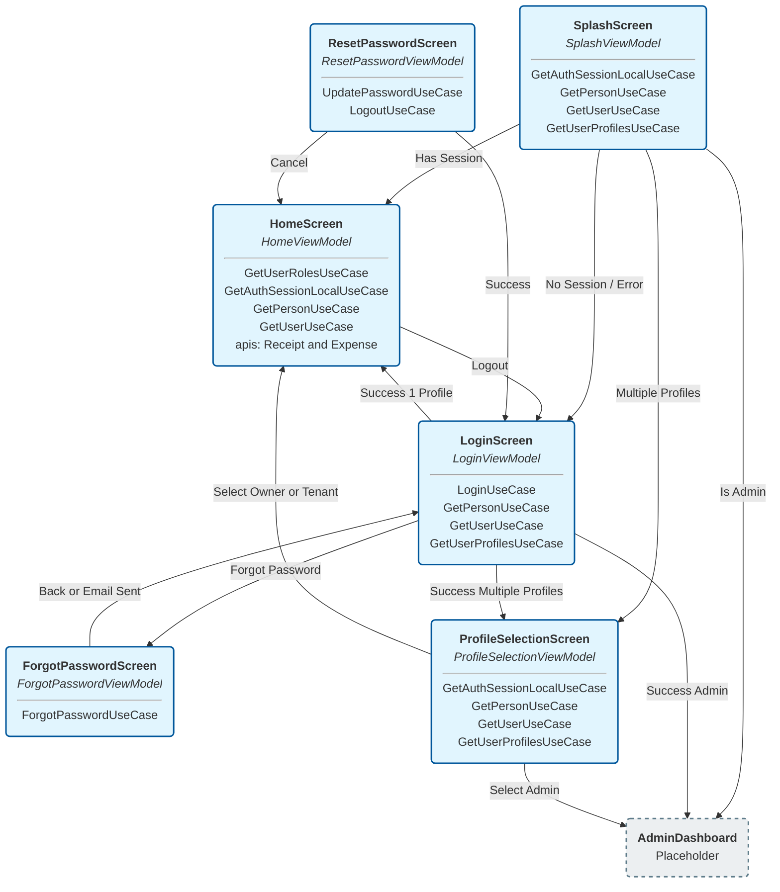

# Application Navigation & Architecture Analysis

This document outlines the navigation flow of the Altopia application and the Use Cases employed by each screen/ViewModel.

## Navigation Flow Diagram

The following diagram illustrates the screen transitions and the Use Cases injected into each screen's ViewModel.

## Detailed Screen Analysis

### 1. SplashScreen
*   **ViewModel**: `SplashViewModel`
*   **Purpose**: Initial app entry point. Checks for active local session.
*   **Flow Logic**:
    *   Checks `AuthSession` locally.
    *   If session exists, fetches `Person`, `User`, and `Profiles`.
    *   Redirects based on profile count and type:
        *   **Admin** -> `AdminDashboard`
        *   **Multiple Profiles** -> `ProfileSelectionScreen`
        *   **Single Profile (Owner/Tenant)** -> `HomeScreen`
    *   If no session or error -> `LoginScreen`
*   **Use Cases**:
    *   `GetAuthSessionLocalUseCase`
    *   `GetPersonUseCase`
    *   `GetUserUseCase`
    *   `GetUserProfilesUseCase`

### 2. LoginScreen
*   **ViewModel**: `LoginViewModel`
*   **Purpose**: Authenticate user via Email/Password.
*   **Flow Logic**:
    *   Validates credentials -> `LoginUseCase`.
    *   On success, fetches user context (`Person`, `User`, `Profiles`) similar to Splash.
    *   Redirects to `Home`, `ProfileSelection`, or `AdminDashboard`.
    *   "Forgot Password" click -> `ForgotPasswordScreen`.
*   **Use Cases**:
    *   `LoginUseCase`
    *   `GetPersonUseCase`
    *   `GetUserUseCase`
    *   `GetUserProfilesUseCase`

### 3. ProfileSelectionScreen
*   **ViewModel**: `ProfileSelectionViewModel`
*   **Purpose**: Allows user to choose context if they have multiple roles/properties.
*   **Flow Logic**:
    *   Loads available profiles for the current session.
    *   User selects a profile:
        *   **Admin** -> `AdminDashboard`
        *   **Property Related** -> `HomeScreen` (with updated context)
*   **Use Cases**:
    *   `GetAuthSessionLocalUseCase`
    *   `GetPersonUseCase`
    *   `GetUserUseCase`
    *   `GetUserProfilesUseCase`

### 4. HomeScreen
*   **ViewModel**: `HomeViewModel`
*   **Purpose**: Main dashboard for Owners/Tenants.
*   **Flow Logic**:
    *   Loads balance, expenses, receipts.
    *   Navigation to Payment (Placeholder).
    *   Navigation to Expense Details (Placeholder).
*   **Use Cases & Services**:
    *   `GetUserRolesUseCase`
    *   `GetAuthSessionLocalUseCase`
    *   `GetPersonUseCase`
    *   `GetUserUseCase`
    *   `ReceiptApiService`
    *   `ExpenseApiService`

### 5. ForgotPasswordScreen
*   **ViewModel**: `ForgotPasswordViewModel`
*   **Purpose**: Iniitate password reset email.
*   **Flow Logic**:
    *   Submit Email -> `ForgotPasswordUseCase`.
    *   On success/back -> `LoginScreen`.
*   **Use Cases**:
    *   `ForgotPasswordUseCase`

### 6. ResetPasswordScreen
*   **ViewModel**: `ResetPasswordViewModel`
*   **Purpose**: Set new password (likely accessed via deep link, handled in `AppNavHost` `Route.ResetPassword`).
*   **Flow Logic**:
    *   Submit new password -> `UpdatePasswordUseCase`.
    *   Logout sessions -> `LogoutUseCase`.
    *   Redirect -> `LoginScreen`.
*   **Use Cases**:
    *   `UpdatePasswordUseCase`
    *   `LogoutUseCase`
